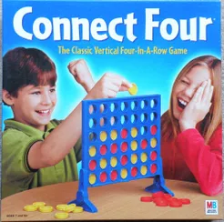
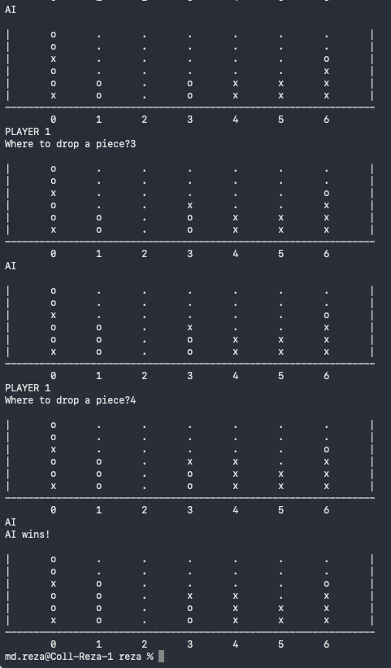

# CS143-SP26-P4
Course: CS143 – Artificial Intelligence (Spring 2026)

Instructor: Md Alimoor Reza, Assistant Professor of Computer Science, Drake University

Due: Tuesday, April 7, 11:59 PM
Total: 10 points

## Solving Connect-Four Game with Adversarial Search

The goal of this assignment is to solve an AI problem using **adversarial search** techinques such as **minimax algorithm** and ***α-β* prunning**. You will work with an AI agent that interacts with a simulated textual environment.

  

You will complete the implementation of: <b>minimax algorithm</b>. Note that incomplete implementations is provided as a skeleton. Your task is to finish the implementation by filling in the missing components and completing all associated tasks. Your code must be in the format supplied. That
is, you need to implement the following functions exactly (or with a small modification) as input in the
starter code:
<ul>
  <li> <a href=""> def actions(self, state): </a>    
  <li> <a href=""> def result(self, state, move, player): </a> 
   <li> <a href=""> def utility(self, state, player):  </a> 
</ul>
If you significantly alter these function headers or do not use these functions, your code will receive 0 points.
You are welcome to search the internet for assistance with the assignment. Be sure to give full credit for any
code cited. However, the foundation of the starter code must be utilized. The assignment is to implement
the minimax algorithm, not simply copy another implementation.

## Task 1 (4 points)
Implement the **minimax algorithm**, including all the supporting methods as follows:
<ul>
  <li> <a href=""> def actions(self, state): </a>    
  <li> <a href=""> def result(self, state, move, player): </a> 
   <li> <a href=""> def utility(self, state, player):  </a> 
</ul>

Utility method can be implemented by a simple utility function that will reward a “win”
with a positive number and a loss with a negative number. All other configurations should return a 0.

## Task 2 (3 points)
Implement a depth parameter that will terminate the search a return the utility function. Completing the
above requirements should provide enough to allow the computer to play a reasonably interactive game with
a depth of 4, that will block an opponent when it is about to win. If you manage to accomplish this, you
should be able to play with the AI opponent and here is a sample output on the terminal:

  

## Task 3 (3 points)
Implement ***α-β* prunning**. You should include in your submission evidence that your implementation
is effective. For example, supply a description (or timings) that you are able to run your program with a
deeper depth that you could without the alpha-beta pruning implementation.

## Extra credit (1 point)
Implement a more sophisticated utility function that provides improved performance in your program.

> It's not manadatory but you could do a comparative analysis using the table below to organize and report your results:

| **Adversarial search**     | **Number of nodes**| **Time took** |
|----------------------------|--------------------|---------------|
| minimax                    |                    |               |
| alpha-beta prunning        |                    |               |

## Grading

The assignment is worth 10 points. Partial credit (4–6 points) will be awarded if any of the required components are incomplete.

* Up to 4 points: You made code changes that demonstrate a reasonable attempt toward implementing minimax algorithm.

### Turning it in

Share the notebook in the same way you did for Project 3.

